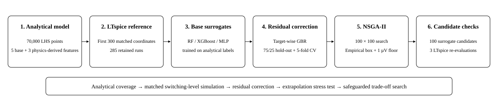

# Physics-Guided Multi-Fidelity Residual Learning for Multi-Objective Design of a DC-DC Buck Converter

**Raushan Kumar**  
Department of Electrical and Electronics Engineering, Lok Nayak Jai Prakash Institute of Technology (Bihar Engineering University), Chapra, Bihar, India  

**Research status:** independent simulation-level research project; manuscript prepared for peer-reviewed submission.  
**Hardware status:** not yet validated on physical hardware.

## Overview

This repository contains the data, notebooks, LTspice source files/logs, figures, and manuscript supporting a physics-guided multi-fidelity design workflow for a nominal fixed-duty **12 V-to-5 V buck converter**.

The study asks whether abundant low-cost analytical data can be corrected with a much smaller set of matched switching-level LTspice simulations before multi-objective optimization—and what happens when an optimizer searches regions where a learned surrogate is unreliable.

<p align="center">
  
</p>

## Research scale

- **70,000** Latin-hypercube analytical design points
- **300** matched automated LTspice runs generated at the first analytical design coordinates
- **285** switching-level simulations retained after numerical/operating sanity filtering
- Random Forest, XGBoost, and multilayer-perceptron analytical surrogates
- Target-wise Gradient Boosting residual correction
- NSGA-II extrapolation stress test followed by a safeguarded bounded search
- **100** final surrogate non-dominated candidates
- **3** representative candidate designs re-evaluated in LTspice

## Main result in one sentence

High analytical-domain ML accuracy did **not** guarantee reliable switching-level transfer or safe optimizer behavior; residual correction improved cross-fidelity accuracy substantially, but the optimization still required an empirical LTspice search envelope and an explicit **1 µV non-negative ripple objective floor**.

## Key stored metrics

| Target | Analytical XGBoost → LTspice R² | Residual hold-out R² | Five-fold residual R² |
|---|---:|---:|---:|
| Efficiency | -2.479 | 0.301 | 0.127 ± 0.093 |
| Output ripple | -0.261 | 0.729 | 0.724 ± 0.095 |
| Total loss | 0.631 | 0.956 | 0.964 ± 0.008 |

Efficiency five-fold MAE is approximately **0.38 percentage points**, which is more interpretable than its low R² because the switching-level efficiency range is narrow.

For the three representative candidates under the original **4–5 ms** validation protocol, the manuscript reports surrogate-to-LTspice differences of **0.38–0.84 percentage points** in efficiency and **0.92–2.43 mV** in output ripple.

A separate source-level window-sensitivity check for the maximum surrogate-predicted-efficiency candidate gives **96.1438%** over 4–5 ms and **95.9074%** over 9–10 ms, with essentially unchanged ripple. The alternate window is treated as a sensitivity check, not as a replacement for the common original validation protocol.

## Curated figures

Only the four figures needed to understand the final scientific story are promoted here:

| Figure | Purpose |
|---|---|
| [`workflow.svg`](figures/main/workflow.svg) | verified multi-fidelity workflow |
| [`ltspice_reference.svg`](figures/main/ltspice_reference.svg) | switching-level reference model and original measurement protocol |
| [`residual_correction.svg`](figures/main/residual_correction.svg) | cross-fidelity failure and residual-correction improvement |
| [`pareto_front.svg`](figures/main/pareto_front.svg) | final bounded surrogate non-dominated candidate set |

All originally uploaded screenshots and development waveforms are preserved non-destructively under [`figures/archive/raw_uploads/`](figures/archive/raw_uploads/). They are archival evidence, not all publication figures.

## Repository map

| Path | What it contains |
|---|---|
| [`manuscript/publication_report.pdf`](manuscript/publication_report.pdf) | current 4-page scientific manuscript |
| [`notebooks/analytical_model.ipynb`](notebooks/analytical_model.ipynb) | analytical equations + 70,000-point dataset generation |
| [`notebooks/spice_automation.ipynb`](notebooks/spice_automation.ipynb) | matched-coordinate LTspice automation and log parsing |
| [`notebooks/ml_training.ipynb`](notebooks/ml_training.ipynb) | RF/XGBoost/MLP, cross-fidelity transfer, residual correction, NSGA-II and candidate selection |
| [`data/analytical/analytical_dataset.csv`](data/analytical/analytical_dataset.csv) | 70,000-row analytical dataset |
| [`data/ltspice/spice_dataset.csv`](data/ltspice/spice_dataset.csv) | retained switching-level dataset used downstream |
| [`data/ltspice/spice_vs_analytical_comparison.csv`](data/ltspice/spice_vs_analytical_comparison.csv) | matched analytical/LTspice comparison |
| [`data/pareto/pareto_front_constrained.csv`](data/pareto/pareto_front_constrained.csv) | final 100-candidate constrained Pareto set |
| [`ltspice/reference/Draft1.asc`](ltspice/reference/Draft1.asc) | common/reference LTspice schematic used by automation |
| [`ltspice/validation/`](ltspice/validation/) | representative candidate LTspice schematics |
| [`ltspice/logs/`](ltspice/logs/) | direct LTspice measurement logs |
| [`docs/METHODOLOGY.md`](docs/METHODOLOGY.md) | implementation details, assumptions, safeguards and limitations |
| [`docs/REPRODUCIBILITY.md`](docs/REPRODUCIBILITY.md) | source-to-result reproduction guide |
| [`docs/FILE_GUIDE.md`](docs/FILE_GUIDE.md) | exact artifact/provenance map |
| [`docs/REPOSITORY_STATUS.md`](docs/REPOSITORY_STATUS.md) | what is present and known archival limitations |

## Important methodological details

The final NSGA-II search uses the empirical per-variable extrema of the **285 retained LTspice rows** rather than claiming a densely validated multidimensional physical domain. Approximate final bounds are:

```text
L        2.17–46.6 µH
C        10.1–468 µF
fsw      102.201–999.719 kHz
RDS(on)  5.1–49.9 mΩ
```

The final objective applies:

```text
ripple_objective = max(raw_corrected_ripple, 1e-6 V)
```

The 100 final points are therefore described as **surrogate non-dominated candidates**, not as 100 physically validated designs.

## Scope and interpretation

This work is **physics-guided**, not a PINN-style method: converter equations generate the low-fidelity dataset and physics-derived engineered features, while governing equations are not embedded as a neural-network training loss.

LTspice is a **higher-detail switching reference relative to the analytical model**, not experimental ground truth. The reference model uses simplified switch/diode representations, and no hardware prototype is claimed.

The 5 V value is a nominal analytical target. The switching-level study uses a fixed open-loop duty ratio; closed-loop output-voltage regulation is outside the optimized objectives.

## Reproducibility note

The historical notebooks are preserved close to the form in which the research was performed. Some cells use local relative paths such as `analytical_dataset.csv` and `Draft1.asc`. The repository separates source files into professional folders, so follow [`docs/REPRODUCIBILITY.md`](docs/REPRODUCIBILITY.md) when creating a rerun workspace rather than assuming every notebook will execute from its repository folder without path preparation.

The historical Python environment was not version-locked. `requirements.txt` records the known dependency families but does not fabricate package versions. Before an archival DOI release, an exact environment export should be added if the original working environment is still available.

## Research contribution

The contribution is methodological rather than a new ML algorithm:

1. large analytical low-fidelity coverage,
2. matched cross-fidelity assessment against switching-level simulation,
3. residual correction from limited LTspice data,
4. optimizer-driven extrapolation diagnosis,
5. bounded/safeguarded multi-objective re-optimization, and
6. source-level auditability of the reported workflow.

## Citation and release status

Citation metadata is available in [`CITATION.cff`](CITATION.cff). A DOI and/or arXiv identifier will be added only after an actual archival/preprint release. Until peer-reviewed acceptance, this work should be described as a **manuscript/preprint or submitted manuscript**, not as a published peer-reviewed article.

## License

No reuse license has been selected yet. This is intentional: code/data licensing affects downstream reuse rights and will be chosen before the first archival release.

## Contact

Raushan Kumar  
Email: raushankumar321670@gmail.com
